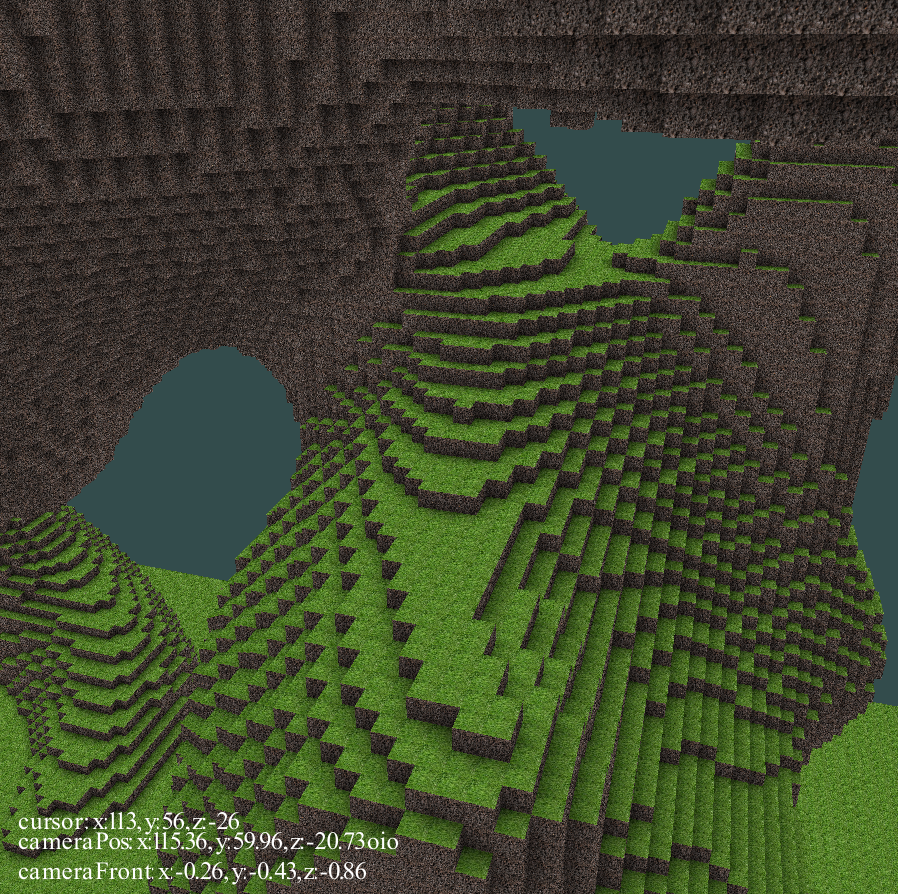
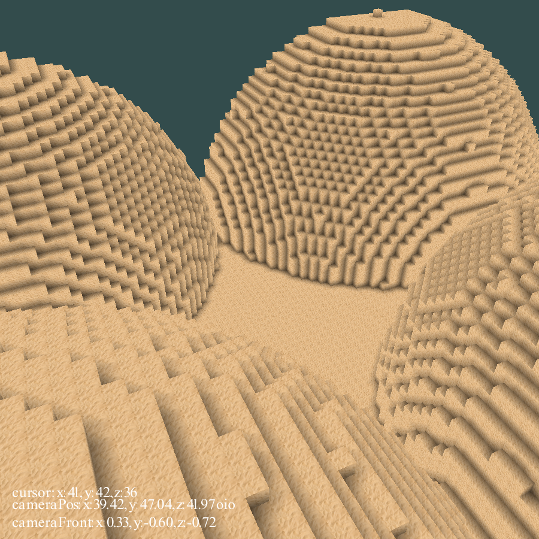

# voxelgame
Game engine written in c++ focused on handling voxel terrain.

 

## Acknowledgements / Libraries
* https://learnopengl.com/
* https://glad.dav1d.de/
* https://www.glfw.org/
* https://github.com/g-truc/glm
* https://www.khronos.org/opengl/wiki/Common_Mistakes#The_Object_Oriented_Language_Problem 

