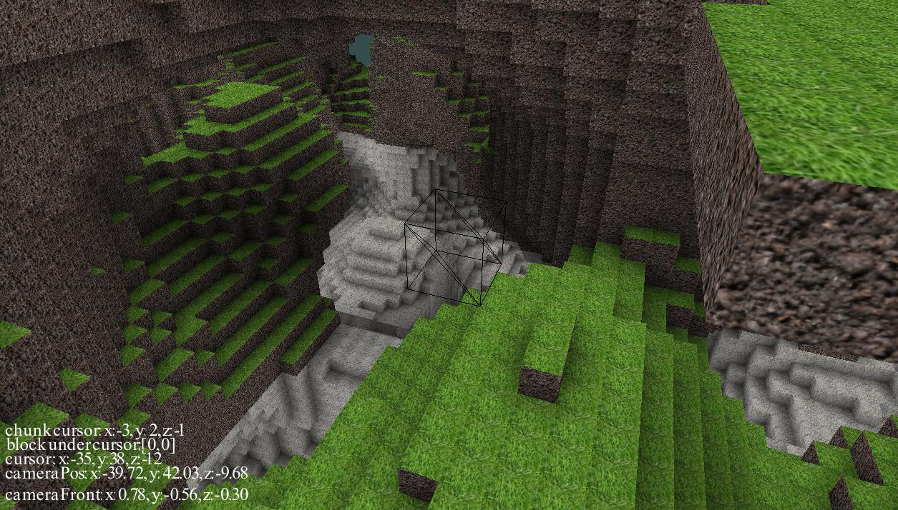
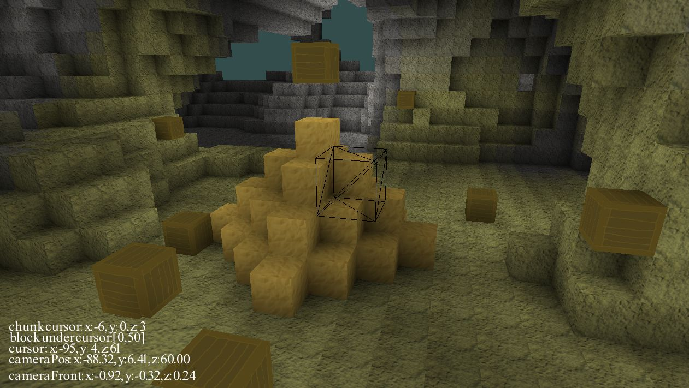

# voxelgame
Game engine written in c++ focused on handling voxel terrain.

## [Try it](https://snsv-dy.github.io/voxel/dynamicWorld/voxelgame.html)
I have compiled a webassembly version so it can be played in browser.
Use W, S, A, D, Space, LShift to move. 
1, 2, 3, 4 to change blocks (there is no indication you have to place them to see the change)
Lmb to destroy blocks, rmb to place them.
It's running a bit slower than native application, also it doesn't help that everything is running on single thread (terrain generation, light updates, drawing), so I've prepared [version with fixed world size](https://snsv-dy.github.io/voxel/fixedWorld/voxelgame.html) so the game won't freeze for 3 seconds everytime you move to another chunk.

### It looks like this

## Compilation
#### Linux
Make sure you have all libraries that are listed in makefile under the LFLAGS variable, and type make.
#### Webassembly
Should be working on any system, but em++ should be set in terminal before. To compile this version type make web.

## Acknowledgements / Libraries
* https://learnopengl.com/
* https://glad.dav1d.de/
* https://www.glfw.org/
* https://github.com/g-truc/glm
* https://www.khronos.org/opengl/wiki/Common_Mistakes#The_Object_Oriented_Language_Problem 
* [javidx9's networking tutorial](https://www.youtube.com/watch?v=2hNdkYInj4g) [&#40;Code&#41;](https://github.com/OneLoneCoder/olcPixelGameEngine/tree/master/Videos/Networking/Parts1%262)

